* content
{:toc}

# 前言

session 主要用于身份验证,登陆后的 session 保存在服务器,如果 session 存在网站目录,或者 session 存储于数据库,如果存在 sql 注入或者目录浏览等漏洞,得到这个用户登录后的 session,恶意用户得到这个 session 可以伪造进行登录.

## session介绍

session 机制是一种服务器端的机制，服务器使用一种类似于散列表的结构（也可能就是使用散列表）来保存信息。

当程序需要为某个客户端的请求创建一个 session 的时候，服务器首先检查这个客户端的请求里是否已包含了一个 session 标识 - 称为 session id，如果已包含一个 session id 则说明以前已经为此客户端创建过session，服务器就按照 session id 把这个 session 检索出来使用（如果检索不到，可能会新建一个），如果客户端请求不包含 session id，则为此客户端创建一个 session 并且生成一个与此 session 相关联的session id，session id 的值应该是一个既不会重复，又不容易被找到规律以仿造的字符串，这个 session id 将被在本次响应中返回给客户端保存。

保存这个 session id 的方式可以采用 cookie，这样在交互过程中浏览器可以自动的按照规则把这个标识发送给服务器。

+ session 一般用于登录验证。
+ session 的周期：
    + 默认关闭浏览器，session 就会消失。
    + 在程序中设置 session 的过期时间

+ session 是存在于服务器里，cookie 是存在客户端。
+ session 的机制是: 会在浏览器生成一个 cookie session_id 也会在服务器里生产一个 session id 文件 假如在做身份证认证的时候就会在这个服务器里的文件写入要验证的内容。
+在 php 里 session 的存放位置是 在 php.ini 里设置的，也可以通过函数设置在其他位置

## session身份绕靶场

以月师傅ubuntu靶场为例：

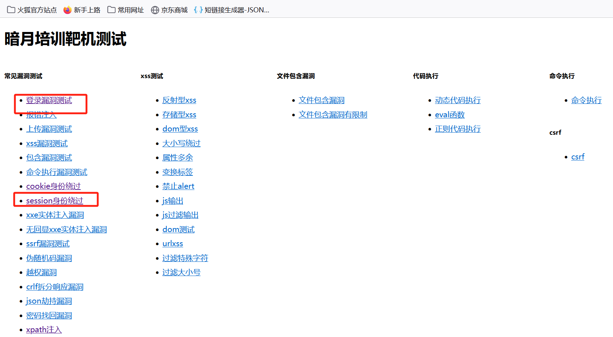
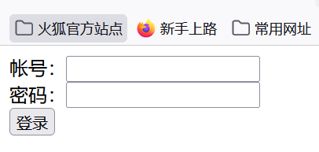

## session身份绕过源码分析
当用户登录成功后,设置 session 验证的文件,24 小后自动销毁.seesion 将保存在网站 tmp 目录下。

```
<?php
$path_parts = pathinfo(__FILE__);
//session保存位置
$save_seesion=$path_parts['dirname'].'/tmp';
session_save_path($save_seesion);
session_start();
$username='moon';
$password='moon123';
echo '<meta charset="UTF-8">';
if($_GET['c']=='login'){
    //判断session id值是否为$username
	if($_SESSION['username']==$username){
		echo "欢迎回来!{$_SESSION['username']}";	
	}else{
        //判断登录账号和密码是否正确
		if($_POST['username']==$username && $_POST['password']==$password){
			$_SESSION['username']=$username;
            //session id 是否为空
			isset($PHPSESSID)?session_id($PHPSESSID):$PHPSESSID = session_id();
            //设置session失效周期
			setcookie('PHPSESSID', $PHPSESSID, time()+24 * 3600);
			echo "登录成功 {$_SESSION['username']}";
		}else{
			echo "帐号或者密码出错<a href='session.php'>返回</a>";
		}	
	}	
}else{
	echo"<form method='post' action='?c=login'>";
	echo"<label>帐号：</label><input type='text' name='username'><br>";
	echo"<label>密码：</label><input type='password' name='password'><br>";
	echo"<input type='submit' value='登录' name='submit'>";
	echo "</form>";
}
?>
```
## session身份绕过漏洞攻击
+ 扫描网站目录,寻找敏感目录。在本例中找到 tmp 目录,tmp 目录可被浏览, 当用户访问当前的页面的时候就会在tmp目录下生成session_id, 登录过后的用户就会在session_id 里存在用户名。

    + 登录页面访问获取session id：
    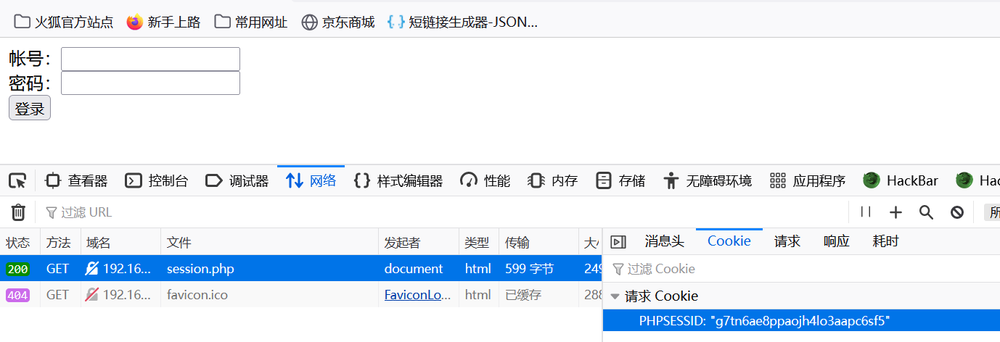
    同一浏览器访问session id一致

    + session id保存位置及服务端查看
    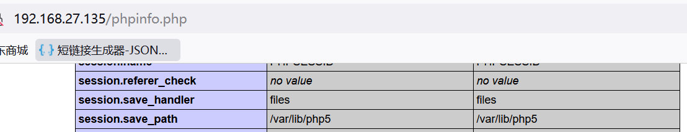
    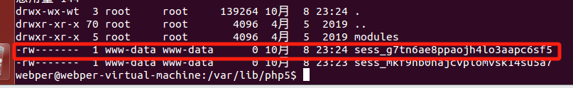

    + 登录过后查看
    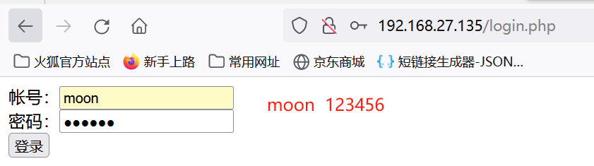
    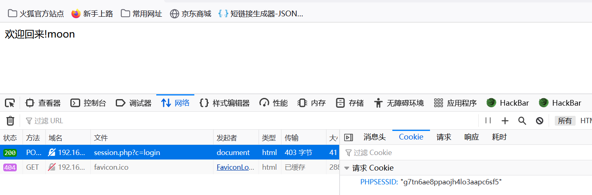
    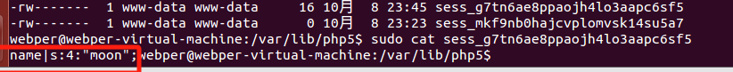

+ 检索所有当前的 session_id 进行验证绕过。 如果存在用户即可绕过。用burpsuite 替换 cookie PHPSESSID 的值 就可以绕过。

    + 换浏览器登录
    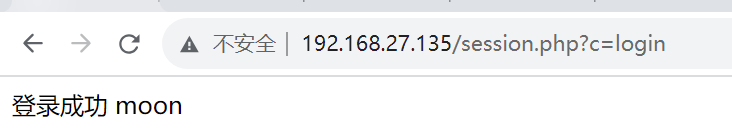

    + 当前靶场tmp目录，检索是否存在登录用户
    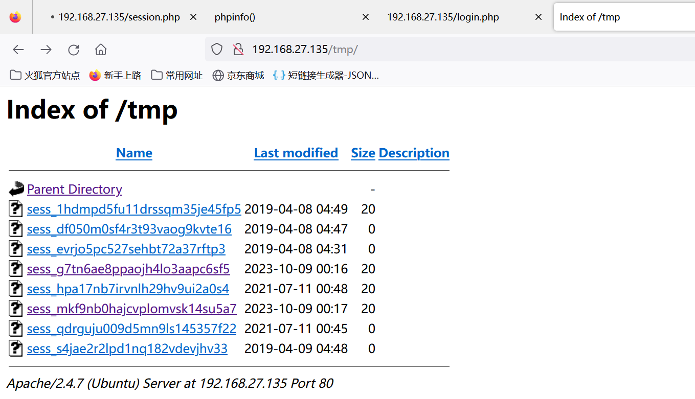
    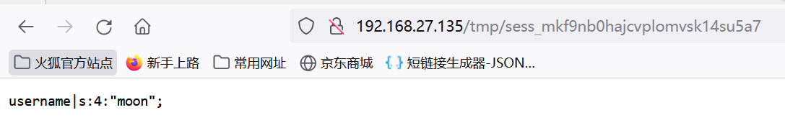

    + 抓包并切换已登录过用户session id:
    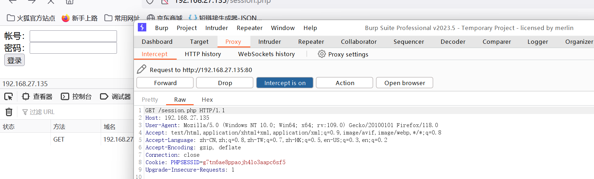
    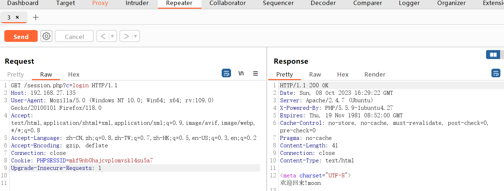

## Reference
[网络安全渗透测试—[常规漏洞挖掘与利用篇14]—[SESSION身份验证绕过漏洞与测试]](https://blog.csdn.net/qq_45555226/article/details/122790287)